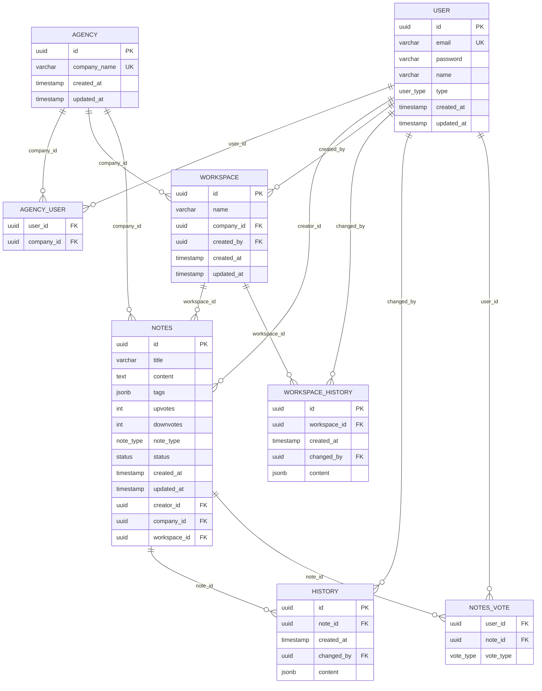

# Database Design

PostgreSQL, managed via Drizzle ORM. Source of truth: `backend/src/db/schema.ts`, migrations in `backend/drizzle/*.sql`. This doc reflects the schema **as currently implemented** (the earlier draft below the DDL had drifted from reality — e.g. `vote_type` enum, `history.note_id`, and `workspace_history` were added since it was written).

## Entity Relationship Diagram



## Tables

### `user`
| Column | Type | Notes |
|---|---|---|
| id | uuid PK (v7) | |
| email | varchar, unique | indexed |
| password | varchar | bcrypt hash |
| name | varchar | indexed |
| type | enum `user_type` | `system_user` \| `agency_user` |
| created_at / updated_at | timestamp | default now() |

### `agency`
| Column | Type | Notes |
|---|---|---|
| id | uuid PK | |
| company_name | varchar, unique | indexed |
| created_at / updated_at | timestamp | |

### `agency_user` (join table)
| user_id | uuid FK → user.id | composite PK |
| company_id | uuid FK → agency.id | composite PK |

Many-to-many membership — a user can belong to multiple agencies.

### `workspace`
| Column | Type | Notes |
|---|---|---|
| id | uuid PK | |
| name | varchar | |
| company_id | uuid FK → agency.id | |
| created_by | uuid FK → user.id | |
| created_at / updated_at | timestamp | |

Unique `(name, company_id)`. Indexed on `name` and `(name, created_by)`.

### `workspace_history`
| Column | Type | Notes |
|---|---|---|
| id | uuid PK | |
| workspace_id | uuid FK → workspace.id | |
| created_at | timestamp | |
| changed_by | uuid FK → user.id | |
| content | jsonb | snapshot |

Indexed on `(workspace_id, created_at)`. **Table exists in schema but nothing reads or writes it yet** — workspace edits/renames aren't versioned, unlike notes.

### `notes`
| Column | Type | Notes |
|---|---|---|
| id | uuid PK | |
| title | varchar, not null | |
| content | text, nullable | |
| tags | jsonb, nullable | |
| upvotes / downvotes | integer, default 0 | denormalized counters |
| note_type | enum `note_type` | `public` \| `private` |
| status | enum `status` | `draft` \| `published` |
| created_at / updated_at | timestamp | |
| creator_id | uuid FK → user.id | |
| company_id | uuid FK → agency.id | |
| workspace_id | uuid FK → workspace.id | |

Five composite indexes support listing/sort/filter: `(creator_id, upvotes, downvotes, created_at)`, `(creator_id, title, upvotes, downvotes, created_at)`, `(company_id, title, upvotes, downvotes, created_at)`, `(company_id, upvotes, downvotes, created_at)`, `(status, upvotes, downvotes, created_at)`.

### `history`
| Column | Type | Notes |
|---|---|---|
| id | uuid PK | |
| note_id | uuid FK → notes.id | |
| created_at | timestamp | |
| changed_by | uuid FK → user.id | |
| content | jsonb | snapshot of the note's *previous* content |

Indexed on `(note_id, created_at)`. A row is written only when `content` actually changes (on update or restore) — title/tags/status-only edits don't version. Rows older than 7 days are purged nightly (see cron doc).

### `notes_vote`
| Column | Type | Notes |
|---|---|---|
| user_id | uuid FK → user.id | composite PK |
| note_id | uuid FK → notes.id | composite PK |
| vote_type | enum `vote_type` | `upvote` \| `downvote` |

One vote per user per note. Re-casting the same vote retracts it; casting the opposite flips it. `notes.upvotes`/`downvotes` are updated in the same transaction as the vote write.

## Schema DDL

```sql
CREATE TYPE user_type AS ENUM ('system_user', 'agency_user');
CREATE TYPE note_type AS ENUM ('public', 'private');
CREATE TYPE status AS ENUM ('draft', 'published');
CREATE TYPE vote_type AS ENUM ('upvote', 'downvote');

CREATE TABLE "user" (
    id          UUID PRIMARY KEY,
    email       VARCHAR NOT NULL UNIQUE,
    password    VARCHAR NOT NULL,
    name        VARCHAR NOT NULL,
    type        user_type NOT NULL,
    created_at  TIMESTAMP NOT NULL DEFAULT now(),
    updated_at  TIMESTAMP NOT NULL DEFAULT now()
);
CREATE INDEX idx_user_email ON "user" (email);
CREATE INDEX idx_user_name  ON "user" (name);

CREATE TABLE agency (
    id            UUID PRIMARY KEY,
    company_name  VARCHAR NOT NULL UNIQUE,
    created_at    TIMESTAMP NOT NULL DEFAULT now(),
    updated_at    TIMESTAMP NOT NULL DEFAULT now()
);
CREATE INDEX idx_agency_company_name ON agency (company_name);

CREATE TABLE agency_user (
    user_id     UUID NOT NULL REFERENCES "user"(id),
    company_id  UUID NOT NULL REFERENCES agency(id),
    PRIMARY KEY (user_id, company_id)
);

CREATE TABLE workspace (
    id          UUID PRIMARY KEY,
    name        VARCHAR NOT NULL,
    company_id  UUID NOT NULL REFERENCES agency(id),
    created_by  UUID NOT NULL REFERENCES "user"(id),
    created_at  TIMESTAMP NOT NULL DEFAULT now(),
    updated_at  TIMESTAMP NOT NULL DEFAULT now(),
    UNIQUE (name, company_id)
);
CREATE INDEX idx_workspace_name ON workspace (name);
CREATE INDEX idx_workspace_name_created_by ON workspace (name, created_by);

CREATE TABLE workspace_history (
    id            UUID PRIMARY KEY,
    workspace_id  UUID NOT NULL REFERENCES workspace(id),
    created_at    TIMESTAMP NOT NULL DEFAULT now(),
    changed_by    UUID NOT NULL REFERENCES "user"(id),
    content       JSONB NOT NULL
);
CREATE INDEX idx_workspace_history_workspace_id_created_at ON workspace_history (workspace_id, created_at);

CREATE TABLE notes (
    id            UUID PRIMARY KEY,
    title         VARCHAR NOT NULL,
    content       TEXT,
    tags          JSONB,
    upvotes       INTEGER NOT NULL DEFAULT 0,
    downvotes     INTEGER NOT NULL DEFAULT 0,
    note_type     note_type NOT NULL,
    status        status NOT NULL,
    created_at    TIMESTAMP NOT NULL DEFAULT now(),
    updated_at    TIMESTAMP NOT NULL DEFAULT now(),
    creator_id    UUID NOT NULL REFERENCES "user"(id),
    company_id    UUID NOT NULL REFERENCES agency(id),
    workspace_id  UUID NOT NULL REFERENCES workspace(id)
);
CREATE INDEX idx_notes_creator_id_upvotes_downvotes_created_at
    ON notes (creator_id, upvotes, downvotes, created_at);
CREATE INDEX idx_notes_creator_id_title_upvotes_downvotes_created_at
    ON notes (creator_id, title, upvotes, downvotes, created_at);
CREATE INDEX idx_notes_company_id_title_upvotes_downvotes_created_at
    ON notes (company_id, title, upvotes, downvotes, created_at);
CREATE INDEX idx_notes_company_id_upvotes_downvotes_created_at
    ON notes (company_id, upvotes, downvotes, created_at);
CREATE INDEX idx_notes_status_upvotes_downvotes_created_at
    ON notes (status, upvotes, downvotes, created_at);

CREATE TABLE history (
    id          UUID PRIMARY KEY,
    note_id     UUID NOT NULL REFERENCES notes(id),
    created_at  TIMESTAMP NOT NULL DEFAULT now(),
    changed_by  UUID NOT NULL REFERENCES "user"(id),
    content     JSONB NOT NULL
);
CREATE INDEX idx_history_note_id_created_at ON history (note_id, created_at);

CREATE TABLE notes_vote (
    user_id    UUID NOT NULL REFERENCES "user"(id),
    note_id    UUID NOT NULL REFERENCES notes(id),
    vote_type  vote_type NOT NULL,
    PRIMARY KEY (user_id, note_id)
);
```

## Known Gaps
- `workspace_history` has no read/write code path — dead schema or a planned-but-unbuilt feature.
- No soft-delete anywhere; `notes.service.remove()` exists (hard delete) but no route calls it.
- Only `content` is versioned in `history` — title/tags/status changes aren't captured.
