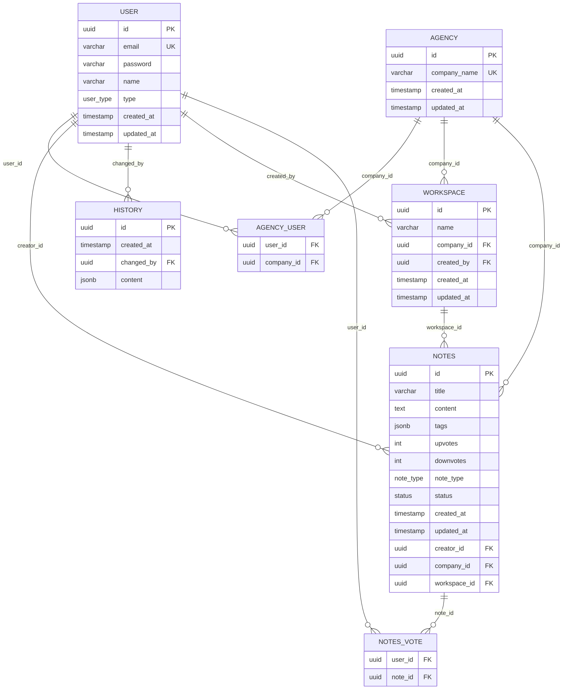

# Database Design

## Notes (source)

type (enum) (system_user, agency_user)
note_type enum (public, private)
status enum (draft, published)
user (id, email, password, name, type, created_at, updated_at) email unique, id pk, email, name should have index, name + created_by index
agency (id, company_name, created_at, updated_at) id pk, company_name unique, name index, name + created_by index
agency_user(user_id, company_id) restrict only user of agency_user
workspace(id, name, company_id(foreign_key), created_by(foreign_key), created_at, updated_at) name index, id pk, name + company_id unique, name + created_by index
notes(id, title, content, tags, upvotes, downvotes, note_type, status, created_at, updated_at, creator_id, comapny_id, workspace_id) id pk, index note_type, title, upvotes, downvotes, created_at, creator_id, tags jsonb, index company_id + note_type, company_id + title, creator_id + (upvotes, downvotes, created_at), creator_id + title + (upvotes, downvotes, created_at), company_id + title + (upvotes, downvotes, created_at), status + (upvotes, downvotes, created_at)
history(id, created_at, changed_by, content(current, old)) id pk, content jsonb,
notes_vote(user_id, note_id)

primary key should be guid v7, timestamp should timestamp

## AI instruction for doc modification
Generate schema, mermaid and dont suggest or do any modification, database is postgres. Just generate what been asked.

## Schema (SQL DDL)

> Column types not stated in the source notes are mapped to standard PostgreSQL types (chosen because `tags jsonb` / `content jsonb` implies Postgres). Per "primary key should be guid v7, timestamp should timestamp": all primary/foreign keys are `UUID` and all timestamp columns are `TIMESTAMP`. `notes.status` uses the `status` enum (draft, published). No fields, tables, or relationships beyond what's listed above were added.
>
> The source notes request a `name + created_by` index on `user` (line 8) and on `agency` (line 9), but neither table's column list includes a `created_by` column (only `workspace` has one) — so those two composite indexes are not created. `idx_user_name` / `idx_agency_company_name` (single-column) are created as the closest satisfiable requirement.

```sql
-- enums
CREATE TYPE user_type AS ENUM ('system_user', 'agency_user');
CREATE TYPE note_type AS ENUM ('public', 'private');
CREATE TYPE status AS ENUM ('draft', 'published');

-- user
CREATE TABLE "user" (
    id          UUID PRIMARY KEY, -- guid v7
    email       VARCHAR NOT NULL UNIQUE,
    password    VARCHAR NOT NULL,
    name        VARCHAR NOT NULL,
    type        user_type NOT NULL,
    created_at  TIMESTAMP NOT NULL DEFAULT now(),
    updated_at  TIMESTAMP NOT NULL DEFAULT now()
);
CREATE INDEX idx_user_email ON "user" (email);
CREATE INDEX idx_user_name  ON "user" (name);

-- agency
CREATE TABLE agency (
    id            UUID PRIMARY KEY, -- guid v7
    company_name  VARCHAR NOT NULL UNIQUE,
    created_at    TIMESTAMP NOT NULL DEFAULT now(),
    updated_at    TIMESTAMP NOT NULL DEFAULT now()
);
CREATE INDEX idx_agency_company_name ON agency (company_name);

-- agency_user (join table; restricted to agency-type users only)
CREATE TABLE agency_user (
    user_id     UUID NOT NULL REFERENCES "user"(id),
    company_id  UUID NOT NULL REFERENCES agency(id),
    PRIMARY KEY (user_id, company_id)
);
-- "restrict only user of agency_user": user_id must reference a user with type = 'agency_user'

-- workspace
CREATE TABLE workspace (
    id          UUID PRIMARY KEY, -- guid v7
    name        VARCHAR NOT NULL,
    company_id  UUID NOT NULL REFERENCES agency(id),
    created_by  UUID NOT NULL REFERENCES "user"(id),
    created_at  TIMESTAMP NOT NULL DEFAULT now(),
    updated_at  TIMESTAMP NOT NULL DEFAULT now(),
    UNIQUE (name, company_id)
);
CREATE INDEX idx_workspace_name ON workspace (name);
CREATE INDEX idx_workspace_name_created_by ON workspace (name, created_by);

-- notes
CREATE TABLE notes (
    id            UUID PRIMARY KEY, -- guid v7
    title         VARCHAR NOT NULL,
    content       TEXT,
    tags          JSONB,
    upvotes       INTEGER NOT NULL DEFAULT 0,
    downvotes     INTEGER NOT NULL DEFAULT 0,
    note_type     note_type NOT NULL,
    status        status NOT NULL,
    created_at    TIMESTAMP NOT NULL DEFAULT now(),
    updated_at    TIMESTAMP NOT NULL DEFAULT now(),
    creator_id    UUID NOT NULL REFERENCES "user"(id),
    company_id    UUID NOT NULL REFERENCES agency(id),
    workspace_id  UUID NOT NULL REFERENCES workspace(id)
);

CREATE INDEX idx_notes_company_id_title     ON notes (company_id, title);
CREATE INDEX idx_notes_company_id_title     ON notes (company_id, title, upvotes, downvotes, created_at);
CREATE INDEX idx_notes_creator_id_upvotes_downvotes_created_at
    ON notes (creator_id, upvotes, downvotes, created_at);
CREATE INDEX idx_notes_creator_id_title_upvotes_downvotes_created_at
    ON notes (creator_id, title, upvotes, downvotes, created_at);
CREATE INDEX idx_notes_company_id_title_upvotes_downvotes_created_at
    ON notes (company_id, title, upvotes, downvotes, created_at);
CREATE INDEX idx_notes_status_upvotes_downvotes_created_at
    ON notes (status, upvotes, downvotes, created_at);

-- history
CREATE TABLE history (
    id          UUID PRIMARY KEY, -- guid v7
    created_at  TIMESTAMP NOT NULL DEFAULT now(),
    changed_by  UUID NOT NULL REFERENCES "user"(id),
    content     JSONB NOT NULL -- shape: { "current": ..., "old": ... }
);

-- notes_vote (join table)
CREATE TABLE notes_vote (
    user_id  UUID NOT NULL REFERENCES "user"(id),
    note_id  UUID NOT NULL REFERENCES notes(id),
    PRIMARY KEY (user_id, note_id)
);
```

## Entity Relationship Diagram


